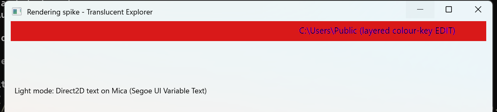
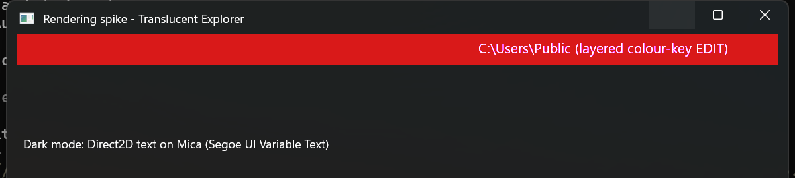
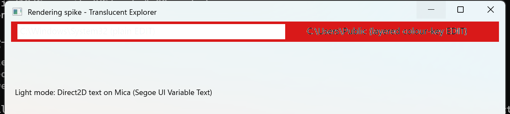
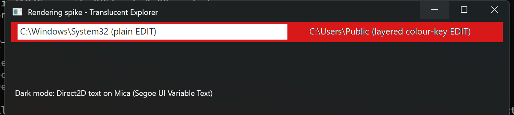
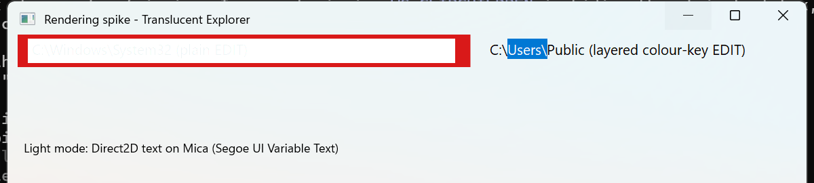
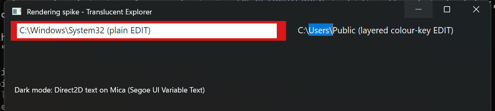

# Spike: Rendering and Accessibility on the Custom Frame (T027)

**Feature**: [spec.md](./spec.md) | **Research**: R-02, R-09 | **Date**: 2026-09-28

**Environment**: Windows 11 (build 26200), 150% scaling (144 DPI), Visual Studio 2026 toolset,
Release build. Mica requested with `DWMWA_SYSTEMBACKDROP_TYPE = DWMSBT_MAINWINDOW`
(returned `S_OK`).

**Harness**: a throwaway test window built from the real components (`CustomTitleBar`,
`CaptionHitTester`, `RenderDevice`, `TextFormats`). It adds a red Direct2D rectangle behind the
test controls, a plain child `EDIT`, and a layered, colour-keyed child `EDIT`. The harness was
not added to the repository; the screenshots below are its output.

## Results

| Check | Result | Evidence |
|-------|--------|----------|
| (a) DWM caption buttons visible and clickable | **Pass** | Visible in every screenshot; `WM_NCHITTEST` returns `HTMINBUTTON` (8), `HTMAXBUTTON` (9), `HTCLOSE` (20) |
| (b) A child `EDIT` paints above the DirectComposition visual | **Pass only with `WS_CLIPCHILDREN`; plain `EDIT` text is not usable** | See below |
| (c) Text correct in light and dark mode | **Pass** | Direct2D title and body text are crisp on light and dark Mica |
| (d) Address edit can be truly translucent (layered, colour-keyed) | **Pass** | Backdrop shows behind the text; no fringes when the key is the surface colour; selection renders |
| (e) Native caption buttons in the UIA tree | **Pass** | UI Automation finds 3 buttons, "Minimize", "Maximize", "Close", each with the Invoke pattern |

### (b) Plain `EDIT`

- **Without `WS_CLIPCHILDREN`** (`light.png`, `dark.png`): the plain `EDIT` is not visible at all. The
  main window's black `WM_PAINT` fill paints over the child.
- **With `WS_CLIPCHILDREN`** (`light-v2.png`, `dark-v2.png`): the `EDIT` box is drawn above the Direct2D
  content. But in light mode its **black text is invisible**. GDI writes alpha 0 into the redirection
  surface, so black text pixels inside the extended frame are fully transparent and the light
  backdrop shows through. In dark mode the same "holes" merely happen to look black.
- **Conclusion**: `WS_CLIPCHILDREN` is required for any child control, and `MainWindow` now uses it.
  A plain, non-layered `EDIT` cannot be used in the glass area.

### (d) Layered, colour-keyed `EDIT`

- The child `EDIT` is created with `WS_EX_LAYERED` and `SetLayeredWindowAttributes(key, 0, LWA_COLORKEY)`.
  `WM_CTLCOLOREDIT` returns a brush in the key colour and `SetBkColor(key)`.
- **With a magenta key** (`light.png`, `dark.png`, right-hand box): the background is transparent and the
  text is opaque. But ClearType edges blend towards magenta, giving purple or pink fringes.
- **With the key set to the surface colour** (`#F3F3F3` light, `#202020` dark; `light-v3.png`,
  `dark-v3.png`): on the real surface the text is crisp with no visible fringe, and the Mica backdrop
  shows behind it. A visible halo appears only where the pixels behind the field differ strongly from
  the key colour, as over the red test rectangle in the v2 shots. In the app, T061 paints the surface
  and text-scrim layers under the address field, which keeps the area behind it close to the key colour.
- The selection highlight renders correctly (blue with white text) in both modes.
- **The caret was not captured**, because it blinks and a still capture can miss it. Confirm it
  manually in V-3a.

## Decisions

1. **`MainWindow` uses `WS_CLIPCHILDREN`**, applied in this task.
2. **T061 uses the layered, colour-keyed edit.** The key colour is `effective.typicalSurfaceColor`,
   updated whenever the effective appearance changes. The tinted opaque fallback is not needed, so the
   plan.md Complexity Tracking sign-off for the address field is **not required**.
3. **T078 does not need caption-button UIA providers**: the native Minimize, Maximize and Close
   buttons are exposed by the system.
4. **Every future child control in the glass area must be layered** (or drawn with Direct2D), because
   GDI text in the extended frame is transparent. This applies to the inline rename `EDIT` (T071).
