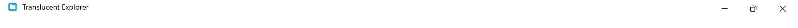

# Validation Report: Translucent Explorer

**Feature**: [spec.md](./spec.md) | **Quickstart**: [quickstart.md](./quickstart.md)

Evidence for SC-011: each delivery phase records its checks here before work moves on
(quickstart "Recording evidence"). A release cannot ship with an open sign-off.

## Sign-offs

Decisions the project owner (the repository maintainer) must approve. Each entry records the
decision, the date, the approver and a link to the evidence.

| Decision | Status | Date | Approver | Evidence |
|----------|--------|------|----------|----------|
| — | No open sign-offs | | | The address-field fallback is not needed: the T027 spike confirmed the translucent layered edit ([spike-rendering.md](./spike-rendering.md)). |

## Phase 1 — Native Win32 shell, MSVC build, title-bar integration

**Date**: 2026-09-28 | **Branch**: `001-translucent-explorer` (uncommitted working tree) |
**Environment**: Windows 11 build 26200, 144 DPI (150%), Visual Studio 2026 (MSVC 19.51),
Windows SDK 10.0.26100, CMake 4.4.2

| Exit check | Result | Evidence |
|------------|--------|----------|
| Both presets build with zero warnings (`/W4 /WX`) | **Pass** | `cmake --build --preset x64-debug` and `x64-release`: 0 warnings |
| T020 caption-layout unit tests pass | **Pass** | `ctest -L unit`: 38/38 in Debug and Release (includes 30 T020 cases, 6 hit-classification cases, fallback and real-window checks) |
| T029 window-lifecycle leak test passes | **Pass** | GDI 2 → 2, USER 2 → 2, handles 194 → 194 over 50 cycles (Debug and Release, 5 repeated runs); a deliberate one-brush leak was detected (4 → 54) |
| `tests/manual/caption-and-snap.md` passes | **Partial** | Part A (automated preconditions): 26/26 pass in Release and Debug. Part B: B10 pass (screenshot); **B1–B9 and B11 pending a manual run** |
| Rendering spike recorded | **Pass** | [spike-rendering.md](./spike-rendering.md): (a), (c), (d), (e) pass; (b) pass with `WS_CLIPCHILDREN` |

**Phase 1 status**: all automated exit checks pass. **The manual rows B1–B9 and B11 of
`tests/manual/caption-and-snap.md` must be run by a person** before Phase 1 is fully closed.
B11 also needs 100% and 200% scaling, which the test machine did not provide.

### Defects found and fixed during Phase 1 validation

1. **Maximized caption buttons did not respond.** When maximized, `DwmDefWindowProc` did not
   claim the Minimize, Restore and Close buttons, so clicks there dragged the window and Snap
   Layouts could not appear. Cause: `WM_NCCALCSIZE` pushed the client area down by the frame
   thickness when maximized, and DWM only hit-tests its caption buttons when the client area
   starts at the window's top edge (confirmed by experiment).
   **Fix**: no top inset in `WM_NCCALCSIZE`. The layout reports the rows above the screen as
   `CaptionLayout::contentTopPx`, and the title, icon, picker and drag region start below them.
   Verified by A15–A16 and B10.
2. **Initial window larger than the screen** (found in T024): the Close button was off-screen
   at 150% scaling. The window now opens at no more than 90% of the work area, centred.
3. **Child controls erased by the frame paint** (found in T027): `MainWindow` now has
   `WS_CLIPCHILDREN`.
4. **Test executables not DPI-aware** (found in T022): they now embed the app manifest.

## US1 — Launch and use a translucent Explorer window (Phase 3)

**Date**: 2026-09-28 | **Branch**: `001-translucent-explorer` (uncommitted working tree; last
commit `933c059`) | **Environment**: Windows 11 build 26200, 144 DPI (150%), light mode,
transparency effects on, Visual Studio 2026 (MSVC 19.51), Windows SDK 10.0.26100

| Check | Result | Evidence |
|-------|--------|----------|
| Both presets build with zero warnings (`/W4 /WX`) | **Pass** | `cmake --build --preset x64-debug` and `x64-release` |
| Full test suite | **Pass** | `ctest`: 155/155 in Debug and Release |
| T031 theme-resolution tests | **Pass** | 69/69 in Debug and Release (`tests/unit/ThemeResolveTests.cpp`) |
| T032 contrast tests | **Pass** | 20/20 in Debug and Release (`tests/unit/ContrastTests.cpp`) |
| Rendered legibility, dark / light / high contrast | **Pass** | `tests/unit/LegibilityTests.cpp`: 56 cases, text and secondary text ≥ 4.5:1 over every backdrop extreme; fails if the text scrim is removed (mutation check) |
| V-1a launch (Mica, readable text) | **Pass** | [us1-light-mica.png](validation/us1-light-mica.png); DWM read-back: backdrop type 2 |
| V-1a worst-case legibility (white / black wallpaper) | **Pending — manual** | `tests/manual/themes.md` B2–B3; covered in automation by `LegibilityTests` |
| V-1b runtime switching (Mica → Acrylic → Solid → Mica) | **Pass** (Debug `--backdrop` handoff) | Same window, backdrop type 2 → 3 → 1 → 2, each second launch exits 0; [mica](validation/us1-light-mica.png), [acrylic](validation/us1-light-acrylic.png), [solid](validation/us1-light-solid.png). Folder and selection preservation re-checked in US2/US3 |
| V-1c transparency-effects fallback | **Pending — manual** | `themes.md` B9–B11; rule and status text covered by T031 and `StatusBarTests` |
| V-1c pre-22621 fallback | **Pending — no VM available** | `themes.md` B12; the probe path is covered by `BackdropManagerTests` |
| V-1d caption behaviour | See Phase 1 | `tests/manual/caption-and-snap.md` (manual rows still pending) |
| V-1e high contrast | **Pending — manual** | `themes.md` B14–B15; system colors covered by T031 and `LegibilityTests` |

**US1 status**: every automated check passes. The rows that need system settings changed
(dark mode with a white wallpaper, light mode with a black wallpaper, transparency effects
off and on, high contrast on and off) or a pre-22621 VM are **pending a manual run** of
`tests/manual/themes.md` Part B. They were not run automatically, so the tester's desktop
settings were left unchanged. Rows that need the file list, picker or selection are marked
US2/US3 in the checklist and are run again then.

### Findings during US1

1. **The R-05 text-color rule could pick an unfixable color.** Choosing the text color first
   and then adding a scrim picked near-black text over a dark base in dark Acrylic, which no
   scrim can make legible. The guard now picks the text color that needs the smaller scrim
   (T033; research R-05 updated).
2. **Title scrim seam.** The first Acrylic screenshot showed an unscrimmed strip above the
   title (the resize band). The title's text area now spans the full caption strip (T039).
3. **Open question (not a defect).** In Acrylic and Mica the caption-button rectangle stays
   at zero alpha (T036), so it shows the backdrop without the tint, visible as a slightly
   different rectangle behind the caption buttons ([acrylic](validation/us1-light-acrylic.png)).
   Whether to tint under the buttons is a design decision for the project owner.

## Phase 2 (US2) — Change color from the title bar (Phase 4)

**Date**: 2026-09-28 | **Branch**: `001-translucent-explorer` (uncommitted working tree; last
commit `933c059`) | **Environment**: Windows 11 build 26200, 144 DPI (150%), light mode,
Visual Studio 2026 (MSVC 19.51), Windows SDK 10.0.26100

| Check | Result | Evidence |
|-------|--------|----------|
| Both presets build with zero warnings (`/W4 /WX`) | **Pass** | `cmake --build --preset x64-debug` and `x64-release` |
| Full test suite | **Pass** | `ctest`: 197/197 in Debug and Release |
| T041 settings tests | **Pass** | 17/17 (`tests/unit/SettingsTests.cpp`); also `MainWindowSettingsTests` 7/7, `ColorPickerTests` 13/13, `PaletteTests` 5/5 |
| V-2a placement (normal, maximized, narrow) | **Pass** at 150% | 40-DIP picker, 8-DIP gap in all three; [narrow](validation/us2-v2a-narrow.png). 100% / 200% pending manual |
| V-2b activation (click, Alt+Shift+C) | **Pass** | Popup under the picker, caption buttons unchanged; [open](validation/us2-v2b-open.png) |
| V-2c live, independent changes | **Pass**, one step manual | Teal, tint 50%, surface 60% live and independent; [screenshot](validation/us2-v2c-custom.png). Picking `#8764B8` in Custom… is pending manual (B4) |
| V-2d Solid disables both opacity controls | **Pass** | [solid](validation/us2-v2d-solid.png) |
| V-2e restore and Reset | **Pass** | [restored](validation/us2-v2e-restored.png); Reset keeps the custom colors |
| V-2f corrupt settings | **Pass** | Backup file created, defaults, notice; [corrupt](validation/us2-v2f-corrupt.png) |
| V-2g invalid field | **Pass** | Acrylic kept, tint clamped to 80% |
| V-2h dismissal | **Pass** (Escape, deactivation + swallowed click) | File-list part re-checked in US3 |

Details: `tests/manual/picker.md` Part A (20/20 automated checks) and Part B (manual rows).

**US2 status**: every automated check passes. Pending a manual run of
`tests/manual/picker.md` Part B: scaling at 100% and 200%, real mouse and keyboard use,
the Custom… color dialog, high contrast and Narrator.

### Findings during US2

1. **Near-black text failed some presets at 80% tint** (T042): Navy, Slate, Red, Rose and
   Orange left neither text color at 4.5:1. The dark text color is now pure black, which
   always reaches at least 4.58:1 on an opaque surface (research R-05 updated).
2. **`DS_CONTROL` removed the popup border** (T044): it strips `WS_CAPTION`, which contains
   `WS_BORDER`. The popup now uses `WS_POPUP | WS_BORDER` without `DS_CONTROL`.
3. **Floating-point noise in settings.json** (T047): `0.30000000000000004` was written.
   `SnapOpacity` now returns exact decimals.
4. **Open question for the project owner.** The caption-button rectangle stays at zero
   alpha (T036), so it shows no tint. At high tint strength this is a clearly visible
   untinted block ([purple, 80%](validation/us2-picker-purple.png)). Tinting under the
   caption buttons needs a quick experiment to confirm that DWM still draws and hit-tests
   them.

## Phase 3 (US3) — Navigate and inspect files (Phase 5)

**Date**: 2026-09-28 | **Branch**: `001-translucent-explorer` (uncommitted working tree; last
commit `933c059`) | **Environment**: Windows 11 build 26200, 144 DPI (150%), light mode, Mica,
Visual Studio 2026 (MSVC 19.51), Windows SDK 10.0.26100, test data from
`tools/New-TestData.ps1` in `%TEMP%\te-test` (`LongPathsEnabled` = 0)

| Check | Result | Evidence |
|-------|--------|----------|
| Both presets build with zero warnings (`/W4 /WX`) | **Pass** | `cmake --build --preset x64-debug` and `x64-release` |
| Full test suite | **Pass** | `ctest`: 318/318 in Debug and Release |
| T049 navigation history | **Pass** | `NavigationHistoryTests` 12/12 |
| T050 sort and selection | **Pass** | `SortModelTests` 10/10, `SelectionModelTests` 8/8 |
| T051 generation guard | **Pass** | `GenerationGuardTests` 9/9 |
| T052 directory enumerator | **Pass** | `DirectoryEnumeratorTests` 5/5 against `%TEMP%\te-test` (10,000 files in batches of at most 256; cancel) |
| V-3a address bar, columns, icons | **Pass**, caret manual | [nested](validation/us3-v3a-nested.png); caret visibility is `navigation.md` B1 |
| V-3b Back / Forward / Up | **Pass** | `MainWindowNavigationTests.BackForwardAndUpFollowTheHistory` |
| V-3c sorting, folders first, natural order | **Pass** | All 4 columns × 2 directions; `file1, file2, file10` |
| V-3d open files | **Pass** (no association), `.txt` manual | Our prompt with Open with…, window responsive, no `OpenWith.exe` ([screenshot](validation/us3-v3d-no-association.png)); launching an editor is B4 |
| V-3e unreachable folders | **Pass** | [unmapped drive](validation/us3-v3e-unmapped-drive.png), [access denied](validation/us3-v3e-access-denied.png); the folder and history stay |
| V-3f responsive while loading `10k` | **Pass** | 40 round trips during load with scrolling, resizing and the picker: max 10.8 ms ([loaded](validation/us3-v3f-loaded.png)) |
| V-3g rapid Back / Forward | **Pass** | Checked after every dispatched message: 0 items of another folder or generation |
| V-3h Unicode names and long paths (browsing) | **Pass**, opening files manual | [unicode](validation/us3-v3h-unicode.png), [344-character folder](validation/us3-v3h-longpath.png); file operations there are V-4h |
| `IExplorerBrowser` spike (T065, R-06) | **Done** | [spike-explorerbrowser.md](./spike-explorerbrowser.md): the Shell view paints opaque white over Mica and its GDI text washes out; the custom Direct2D view stays |

Details: `tests/manual/navigation.md` Part A (12/12 automated checks) and Part B (manual rows).

**US3 status**: every automated check passes. Pending a manual run of
`tests/manual/navigation.md` Part B: real mouse and keyboard use, the address-field caret,
opening files with their applications (not automated, so nothing was launched on the
tester's desktop), the system Open with chooser, and 100% / 200% scaling.

### Findings during US3

1. **The keyboard stayed on the closed address field** (fixed). After Enter in the address
   bar, or Escape, the window still routed keys to the address field, so arrows and Enter did
   nothing in the list until a click or F6. Address navigation now moves the focus to the
   list, and a key arriving while the edit is closed goes to the list (`MainWindow`).
2. **Paths longer than `MAX_PATH` could not be typed** (fixed). `PathAllocCanonicalize` with
   `PATHCCH_ALLOW_LONG_PATHS` adds `\\?\` past `MAX_PATH`, and `SHParseDisplayName` rejects
   that prefix. `ShellNavigator` now removes it (also from a typed prefix); test
   `ParsesPathsLongerThanMaxPath`.
3. **The address showed 8.3 names past `MAX_PATH`** (fixed). The Shell reports such a
   folder's parsing path as `…\SEGMEN~1\SEGMEN~1`; the address bar now shows the long names
   (`GetLongPathNameW`).
4. **Emoji drew as monochrome outlines** (fixed). File names, navigation-pane names, the
   address and the title now draw with `D2D1_DRAW_TEXT_OPTIONS_ENABLE_COLOR_FONT`, as
   Explorer does.
5. **Open question for the project owner.** A navigation error stays in the status bar for its
   8 seconds even after a later successful navigation, and hides the item count meanwhile
   ([screenshot](validation/us3-v3h-unicode.png)). Clearing it when the next navigation
   completes would be a small change.
6. **Note on long paths.** With `LongPathsEnabled` = 0 the Shell reaches folders past
   `MAX_PATH` through their 8.3 short names. On a volume with 8.3 names disabled that may not
   work; V-4h and the release run (T099) should include such a volume if one is available.
7. **Not a defect.** A screenshot taken 0 ms after a programmatic resize showed the picker
   at its old position next to the moved caption buttons for one frame; the next frame was
   correct. B6 checks for visible flicker during a real resize.

## Phase 4 (US4) — Manage files safely (Phase 6)

**Date**: 2026-09-28 | **Branch**: `001-translucent-explorer` (uncommitted working tree; last
commit `933c059`) | **Environment**: Windows 11 build 26200, 144 DPI (150%), light mode,
Visual Studio 2026 (MSVC 19.51), Windows SDK 10.0.26100, test data in `%TEMP%\te-test`,
Recycle Bin delete confirmation off, Explorer hides known extensions

| Check | Result | Evidence |
|-------|--------|----------|
| Both presets build with zero warnings (`/W4 /WX`) | **Pass** | `cmake --build --preset x64-debug` and `x64-release` |
| Full test suite | **Pass** | `ctest`: 363/363 in Debug and Release |
| T067 file-operation service tests | **Pass** | `FileOperationServiceTests` 8/8 (T067's 6, plus Move and a rename 344 characters deep) |
| Shell-UI validation (the Shell's own dialogs) | **Pass** | `FileOpsShellUi.*` 6/6 in Release and Debug (`DISABLED_` by default; run with `--gtest_also_run_disabled_tests`) |
| V-4a copy (status "3 items copied") | **Pass**, clipboard keys manual | Real copy through the window; cut → paste moves through the service. Ctrl+C / Ctrl+V with the system clipboard is B1–B2 |
| V-4b conflict → Skip | **Pass** (after a fix) | "Replace or Skip Files" dialog; targets unchanged, sources kept, status "0 of 5 items completed" |
| V-4c inline rename | **Pass** | Invalid name rejected with a balloon tip; the new name shown only after success ([edit](validation/us4-rename-edit.png), [invalid](validation/us4-rename-invalid.png)) |
| V-4d Delete → Recycle Bin | **Pass** | Found in the Recycle Bin by its original path; the test removed exactly that item |
| V-4d Shift+Delete → confirmation → No | **Pass** | The Shell asked; the file stayed; Cancelled |
| V-4e copy into `readonly-acl` | **Pass** | "Destination Folder Access Denied" from the Shell; Cancel; nothing left behind |
| V-4f cancel a `10k` copy | **Pass** | Cancelled after 729 of 10,000 files; UI thread never paused more than 31 ms; "Copying N items…" throughout |
| V-4g context menu and Properties | **Pass** | Real menu ([screenshot](validation/us4-context-menu.png)); Shift+F10 / Menu key; "props Properties" sheet opened and closed |
| V-4h Unicode and long paths | **Pass** | Unicode rename and copy exact; rename and copy 344 characters deep exact |

Details: `tests/manual/file-operations.md` Part A (16/16 automated checks) and Part B
(manual rows).

**US4 status**: every automated check passes, including the six scenarios that raise the
Shell's own dialogs. Pending a manual run of `tests/manual/file-operations.md` Part B: the
keyboard clipboard with the system clipboard (not automated, so the tester's clipboard and
clipboard history were left alone), the same scenarios with real mouse and keyboard, and
100% / 200% scaling.

### Findings during US4

1. **Skipped conflicts counted as done** (fixed, found by V-4b). For each conflicting item
   the Shell first reports `COPYENGINE_S_PENDING` (`0x0027000B`) and later the final result;
   the service posted and counted the pending report, so skipping every file would have read
   "5 items moved". Pending reports are now ignored; the final `COPYENGINE_S_USER_IGNORED` is
   neither done nor failed.
2. **Two deadlocks with a pasted data object** (fixed in T070). The worker released its proxy
   to the UI thread's data object after the final message, and `Shutdown` joined without
   serving COM calls; both hung. Everything is released before the final message, and
   `StaWorker::JoinServingComCalls` waits with `CoWaitForMultipleHandles`.
3. **Rename and hidden extensions** (design, T071–T072). `IFileOperation::RenameItem` takes
   the raw file name (renaming `a.txt` to `c` gives `c`), and with extensions hidden the
   Shell's display and editing names have none. The edit therefore starts from the real name
   with the extension unselected, and the list keeps display and real names apart (a first
   version lost the extension from the stored name, found by the window tests).
4. **Access denied for a single item** (behaviour note). The Shell's own dialog reports the
   error and offers only Cancel (or "Continue" with elevation, which the tests never choose);
   the app then reports the operation as cancelled rather than showing a second error dialog.
   With several items the Shell offers Skip, and failures are listed by the app.
5. **Counts are per requested item** (behaviour note). Copying the `10k` folder and cancelling
   reports "0 items completed" although 729 files inside it were copied: the request named one
   item, the folder. Nested items are counted by the Shell's progress UI, not the status bar.
6. **Open question for the project owner** (from T072). The list does not watch the folder
   (`SHChangeNotifyRegister` is in no task): changes made by other programs appear only after
   F5 or the next navigation.
7. **Test harness only.** A UI Automation query from the test's helper thread stalled for
   minutes after an earlier test's dialog had closed; the recycle itself took 78 ms. The
   helper now runs only when the Recycle Bin confirmation is switched on.

## Phase 5 (US5) — Interaction and accessibility (Phase 7)

**Date**: 2026-09-28 | **Branch**: `001-translucent-explorer` (uncommitted working tree; last
commit `933c059`) | **Environment**: Windows 11 build 26200, one monitor 1920 × 1200 at
144 DPI (150%), light mode, text size 100%, Visual Studio 2026 (MSVC 19.51), Windows SDK
10.0.26100, test data in `%TEMP%\te-test`. Neither Narrator nor Accessibility Insights
was run, and no display or accessibility setting was changed.

| Check | Result | Evidence |
|-------|--------|----------|
| Both presets build with zero warnings (`/W4 /WX`) | **Pass** | `cmake --build --preset x64-debug` and `x64-release` |
| Full test suite | **Pass** | `ctest`: 434/434 in Debug and Release |
| V-5a keyboard only (automated) | **Pass** | F6 ring picker → address → pane → list both ways; Enter / Space on the picker; 2-DIP focus indicator ≥ 3:1, also on selected rows; hidden focus cues shown by keys only ([row](validation/us5-focus-row.png), [picker](validation/us5-focus-picker.png), [address](validation/us5-focus-address.png), [pane](validation/us5-focus-pane.png)) |
| V-5b what Narrator reads (automated, UIA client) | **Pass** | Picker: Button "Appearance and color", Collapsed / Expanded with events, focusable in the F6 ring; file list: DataGrid "Items", rows named after the files with IsSelected; arrows raise focus and selection events; status is a polite live region |
| V-5c accessibility audit (FastPass-style rules, automated) | **Pass** (after 2 fixes) | `UiaAuditTests` 4/4: main window idle (50 elements), while editing the address, during an inline rename, and the appearance popup — no violations |
| V-5d scaling (simulated DPI changes) | **Pass** | Exact scaled size, everything rescaled with the listing kept, no drift on a round trip, popup follows the picker; captures at 150 / 100 / 200 / 150 % ([1](validation/us5-dpi-1-144.png), [2](validation/us5-dpi-2-96.png), [3](validation/us5-dpi-3-192.png), [4](validation/us5-dpi-4-144.png)) |
| V-5e live settings (simulated) | **Pass** | Text size (100 / 150 / 225 % [captures](validation/us5-text-150.png)), animation effects, light / dark, high contrast — all without a restart |
| V-5a–V-5c by a person: keyboard only, Narrator announcements, FastPass on the window and the popup | **Pending** | `tests/manual/accessibility.md` Part B (B1–B13, C1–C2) |
| V-5d–V-5e with real settings: 100 / 150 / 200 %, a scale change while running, two monitors, the Settings switches | **Pending** | `tests/manual/dpi.md` Part B (B1–B11) |

Details: `tests/manual/accessibility.md` Part A (13/13) and `tests/manual/dpi.md` Part A
(12/12).

**US5 status**: every automated check passes. Pending a manual run of both Part B lists:
Narrator and FastPass are not installed or started by the tests (Accessibility Insights is
not installed on this machine), and real scale and settings changes would change the
tester's settings; this PC also has only one monitor.

### Findings during US5

1. **Address while editing: a typeless "Address" element under the EDIT, level after level**
   (fixed, found by the audit, T083). The T078 property-override provider, returned through
   the root's `IRawElementProviderHwndOverride`, was also treated by UIA as a nested element
   of its own ("Override(parent link)" providers with no base). Narrator and FastPass would
   have walked into it. The EDIT is now named with Dynamic Annotation
   (`IAccPropServices::SetHwndPropStr`, new `te::AnnotateHwnd`), which keeps the EDIT's own
   patterns; the override provider was removed.
2. **The inline-rename EDIT had no name** (fixed, the T078 open item): now "Name"
   (`IDS_A11Y_RENAME`), AutomationId `RenameEdit`.
3. **The focus ring on a selected row was invisible** (fixed in T080): it had the selection's
   color. `FocusIndicator` now picks a color with 3:1 against the row.
4. **F6 did nothing inside the address field** (fixed in T080): the EDIT kept the key; it
   now passes F6 / Shift+F6 to the window.
5. **At text size 225 % the title was clipped** (fixed in T082): the caption strip keeps the
   height Windows gives it; the title is drawn smaller when it would not fit.
6. **Icons of the folder on screen could stay unloaded after a failed navigation** (fixed in
   T081): icon requests were cancelled when a navigation started; icons now get their own
   generation when a navigation commits, and again after a DPI change.
7. **The title bar has an empty UIA name** (behaviour note): it is Windows' own non-client
   element; a plain Win32 window's title bar reports the same. The audit exempts it; FastPass
   (C1) is the reference.
8. **Open question for the project owner** (from T078). The Up button's UIA name is its
   localized tooltip, "Up to the parent folder"; UI contract §5 says "Up".

## Phase 6 (US6) — Remain responsive with large folders (Phase 8)

**Date**: 2026-09-28 | **Branch**: `001-translucent-explorer` (uncommitted working tree; last
commit `933c059`) | **Environment**: Windows 11 build 26200, 144 DPI (150%), local SSD,
Visual Studio 2026 (MSVC 19.51), Windows SDK 10.0.26100, test data in `%TEMP%\te-test`.
No latency target is asserted (the spec sets none); timings below are observations.

| Check | Result | Evidence |
|-------|--------|----------|
| Both presets build with zero warnings (`/W4 /WX`) | **Pass** | `cmake --build --preset x64-debug` and `x64-release` |
| Full test suite | **Pass** | `ctest`: 456/456 in Debug and Release |
| V-3f the UI responds while `10k` loads (automated) | **Pass** | Wheel, resize, keys and the popup took effect while items arrived; longest message handler 25 ms (Debug) / 17 ms (Release), none over the watchdog's 50 ms; listing done in about 880 / 550 ms |
| V-3g rapid Back / Forward never mixes folders (automated, T066) | **Pass** | 10 alternations; no item of another folder or generation ever listed; the address matches |
| V-6a enumeration: 10,000 items, cancellation, supersession, shutdown (T084) | **Pass** | `DirectoryEnumeratorTests` 8/8 |
| V-6b 50 lifecycles, idle and while `10k` loads (T029, T085) | **Pass** | GDI, USER and handles at baseline (catalog-cache sections counted apart); every payload freed |
| Shutdown order (T088) | **Pass** | cancel → file operations → workers → drain → UI Automation → graphics |
| Virtualized list and icon pipeline (T086, T087) | **Pass** | Layouts only for visible rows; merged batches; one icon conversion for 10,000 `.txt` rows |
| V-6b Debug CRT leak report | **Pass** (T093) | `tools\Invoke-CrtLeakRun.ps1` (V-3 and V-4 on the Debug build): no leak reported; a planted leak was reported, so the report works. `WindowLifecycle.TheCrtHeapReturnsToBaselineAfterBrowsing`: 0 CRT blocks left after 5 browsing windows |
| By a person: V-3f / V-3g by hand, 20 network round trips, USB unplug while listing, Application Verifier (V-6c), DebugView | **Pending** | `tests/manual/performance.md` Part B (B1–B6) |

Details: `tests/manual/performance.md` Part A (9/9 pass; A9 since T093).

**US6 status**: every automated check passes. Pending a manual run of
`tests/manual/performance.md` Part B: this PC has only the admin shares (not open to the
test account; creating a share would change the system), no removable drive was used, and
Application Verifier, although installed, changes machine settings for the executable when
enabled, so it was left to the tester.

### Findings during US6

1. **"No batch after CancelAll" was not guaranteed** (fixed in T084): the stop check ran
   only between `Next(64)` calls. The stop check and each post now share a lock with
   `CancelAll`, `Start` and `Shutdown`.
2. **Icons of the folder on screen were cancelled when a navigation started** (fixed in
   T081): after a failed navigation (FR-020) the rows still loading never got icons.
3. **File-list icons outlived a lost Direct2D device** (fixed in T087): they are now dropped
   and extracted again on the new device.
4. **The shutdown order differed from the contract** (fixed in T088): UI Automation went
   first, the workers stopped before the file-operation service, and the graphics devices
   were never released explicitly.
5. **A handle that is not ours** (test fix, T085–T086): the Windows component-catalog cache
   (`C:\ProgramData\Microsoft\Windows\Caches\cversions.2.ro`) is mapped again by COM at
   random moments; the lifecycle tests count those sections apart.
6. **Screen hit-testing in tests** (test fix, T086): `ElementFromPoint` answers for whatever
   window is on top; the three hit-test tests keep their window topmost while they test.

## Phase 5 (release) — Release gates (T099)

**Date**: 2026-09-28 | **Branch**: `001-translucent-explorer` (uncommitted working tree; last
commit `933c059`) | **Environment**: Windows 11 build 26200, one monitor at 144 DPI (150%),
light mode, Visual Studio 2026 (MSVC 19.51), Windows SDK 10.0.26100

**Verdict: not yet releasable.** Every automated check passes in Debug and Release, but the
release run T099 asks for is only partly done. The rows marked **Open** below need a person,
a second and third display scale, or an elevated prompt. None of them was done from the
development session, so the tester's display scale, themes, contrast, transparency setting,
clipboard and machine settings were left unchanged. T099 stays open until they pass.

### Build and automated suites

**Re-run 2026-09-30** on Windows 11 build 26300 (the OS updated from 26200), same monitor and
settings, no source changes since 2026-09-28: both clean rebuilds again 0 warnings, 0 errors;
`ctest` 483/483 in Debug and in Release; `tools/Invoke-CrtLeakRun.ps1` exit code 0, CRT report
empty, the recycled scratch file removed from the Recycle Bin. The manual rows are unchanged:
the session was not elevated (T095) and the PC still has one monitor.

| Check | Debug | Release | Evidence |
|-------|-------|---------|----------|
| Clean rebuild (`--clean-first`), `/W4 /WX /permissive-` | **Pass**: 200 translation units, 0 warnings, 0 errors | **Pass**: 200 translation units, 0 warnings, 0 errors | `cmake --build --preset x64-debug --clean-first`, same for `x64-release` |
| Full `ctest` suite, test data from `New-TestData.ps1` | **Pass**: 483/483 | **Pass**: 483/483 | 13 more tests are disabled screenshot generators (for example `MainWindowDpiTest.CaptureAtEachScale`), not checks |
| CRT leak report over V-3 and V-4 (`tools/Invoke-CrtLeakRun.ps1`) | **Pass**: report empty, exit code 0 | — (Debug CRT only) | The run recycled one file and removed exactly that Recycle Bin item |

### Scenarios V-1 to V-6

"Automated" is the result at 150% in both configurations; "Manual" is the checklist Part B
row that still needs a person.

| Scenario | Automated (Debug, Release) | Manual | Result |
|----------|---------------------------|--------|--------|
| V-1a launch, legibility | Pass (`LegibilityTests`, DWM read-back) | [themes.md](../../tests/manual/themes.md) B2–B3 (wallpaper extremes) | **Open** |
| V-1b backdrop switching | Pass | — | **Pass** |
| V-1c transparency off, pre-22621 | Pass (rules, `BackdropManagerTests`) | themes.md B9–B12; needs a pre-22621 VM | **Open** |
| V-1d caption behaviour | Pass ([caption-and-snap.md](../../tests/manual/caption-and-snap.md) Part A 26/26) | caption-and-snap.md B1–B9, B11 | **Open** |
| V-1e high contrast | Pass (`ThemeResolveTests`, `LegibilityTests`) | themes.md B14–B15 | **Open** |
| V-2a–V-2h picker | Pass ([picker.md](../../tests/manual/picker.md) Part A 20/20) | picker.md Part B (100% / 200%, Custom… dialog, high contrast, Narrator) | **Open** |
| V-3a–V-3e navigation | Pass ([navigation.md](../../tests/manual/navigation.md) Part A 12/12) | navigation.md Part B (caret, opening files with their applications) | **Open** |
| V-3f, V-3g responsiveness, rapid navigation | Pass (`MainWindowResponsivenessTests`, `RapidBackForwardNeverMixesFolders`) | [performance.md](../../tests/manual/performance.md) B1–B2 | **Open** |
| V-3h long paths and Unicode (browsing) | Pass | navigation.md Part B (open the files) | **Open** |
| V-4a–V-4g file operations | Pass ([file-operations.md](../../tests/manual/file-operations.md) Part A 16/16) | file-operations.md Part B (system clipboard, real input) | **Open** |
| V-4h long paths and Unicode (file operations) | Pass | — | **Pass** |
| V-5a–V-5c keyboard, Narrator, FastPass | Pass ([accessibility.md](../../tests/manual/accessibility.md) Part A 13/13, `UiaAuditTests`) | accessibility.md B-a, B-b; B-c is T096 (FastPass, deferred to release testing by the project owner) | **Open** |
| V-5d scaling 100% / 150% / 200%, monitor moves | Pass (simulated DPI changes, [dpi.md](../../tests/manual/dpi.md) Part A 12/12) | dpi.md Part B: real 100% and 200%, a scale change while running, two monitors (this PC has one) | **Open** |
| V-5e live settings | Pass (simulated, `MainWindowLiveSettingsTests`) | dpi.md Part B (the real Settings switches) | **Open** |
| V-6a enumeration, cancellation | Pass (`DirectoryEnumeratorTests`) | — | **Pass** |
| V-6b resources and leaks | Pass (50 lifecycles, idle and while `10k` loads; CRT heap baseline; CRT report empty) | performance.md B6 (DebugView, an observation, not a gate) | **Pass** |
| V-6c Application Verifier | — | performance.md B5; T095, needs an elevated prompt | **Open** |
| Network round trips, USB unplug | — | performance.md B3–B4 | **Open** |

### Success criteria

| Criterion | Result | Basis |
|-----------|--------|-------|
| SC-001 backdrop and readable surfaces, legible fallback | **Open** | Automated legibility passes; the V-1a wallpaper extremes, V-1c and V-1e are manual |
| SC-002 picker placement, normal / maximized / resized | **Open** | Passes at 150% (V-2a, `CaptionLayoutTests`); 100% and 200% are manual |
| SC-003 colours, backdrops, Reset, restore after restart | **Pass** | V-2b–V-2h, `SettingsTests`, `MainWindowSettingsTests` |
| SC-004 caption, system menu, taskbar, Alt+Tab, snap, Snap Layouts | **Open** | Defined as a manual suite: caption-and-snap.md Part B |
| SC-005 navigation suite on prepared local folders | **Pass** | V-3a–V-3h automated; the open manual rows (caret, opening files with their applications) are recorded under V-3 |
| SC-006 file operations: success, conflicts, denied, cancel, delete confirmation | **Pass** | V-4a–V-4h, including the Shell's own dialogs |
| SC-007 100% / 150% / 200%, moving between monitors | **Open** | 150% real, the others simulated; real 100% / 200% and two monitors are manual |
| SC-008 keyboard and accessibility suite | **Open** | Automated keyboard, UIA and audit pass; Narrator and FastPass (T096) are manual |
| SC-009 10,000 items responsive, no stale results | **Pass** | V-3f, V-3g, V-6a |
| SC-010 no warnings; no leaks over navigation and repeated windows | **Pass** (Application Verifier open) | 0 warnings in both clean builds; lifecycle tests and CRT report clean. The V-6c Application Verifier run (T095) is still to be done |
| SC-011 each delivery phase has documented, passing stage evidence | **Open** | All sections are present (below); each has passing automated evidence and open manual rows |

### Earlier sections (SC-011)

| Section | Present | Automated | Manual |
|---------|---------|-----------|--------|
| Phase 1 — Native Win32 shell, MSVC build, title-bar integration | Yes | Pass | caption-and-snap.md B1–B9, B11 open |
| US1 — Launch and use a translucent Explorer window (Phase 3) | Yes | Pass | themes.md Part B open |
| Phase 2 (US2) — Change color from the title bar (Phase 4) | Yes | Pass | picker.md Part B open |
| Phase 3 (US3) — Navigate and inspect files (Phase 5) | Yes | Pass | navigation.md Part B open |
| Phase 4 (US4) — Manage files safely (Phase 6) | Yes | Pass | file-operations.md Part B open |
| Phase 5 (US5) — Interaction and accessibility (Phase 7) | Yes | Pass | accessibility.md and dpi.md Part B open |
| Phase 6 (US6) — Remain responsive with large folders (Phase 8) | Yes | Pass | performance.md Part B open |

The polish work (T080–T098: focus indicators, DPI, text scale, UIA audit, shutdown order,
icon cache, folder tree, breadcrumbs, filter, CRT leak check) is covered by the US5 and US6
sections and by the 483 tests above.

### Sign-offs

The "Sign-offs" section at the top has **no open item**: the address field uses the
translucent layered edit, so the fallback that would need the project owner's approval (T061)
was not used. The plan's post-implementation Constitution Check (T098) found no broken MUST
rule and no new item that needs sign-off.

### To close T099

1. Run the Part B rows of every file in `tests/manual/` on build 22621 or later, at 100%,
   150% and 200%, with two monitors at different scales, in Debug and Release; record the
   build in each row.
2. T095: `appverif /verify TranslucentExplorer.exe` from an elevated prompt, V-3 and V-4
   under the debugger, then `appverif /n TranslucentExplorer.exe`.
3. T096: Accessibility Insights FastPass (accessibility.md B-c).
4. Change each **Open** row above to Pass; T099 can then be marked done.
